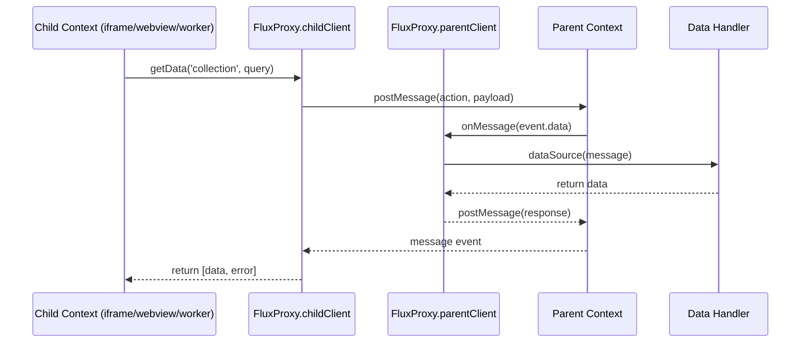

# Flux-Proxy

A library to facilitate communication between contexts (iframes, webview, workers, processes) using a proxy pattern.

## Installation

```bash
npm install flux-proxy
```

## How It Works

The following diagram illustrates the communication flow between parent and child contexts using Flux-Proxy:



## Basic Usage

```typescript
import { FluxProxy } from 'flux-proxy';

// Usage in parent context
const handleData = async (message) => {
  // Process the request and return data
  return { result: 'processed data' };
};

// Listen for messages from child
window.addEventListener('message', (event) => {
  FluxProxy.parentClient.onMessage(
    event.data,
    window,
    handleData
  );
});

// Usage in child context (iframe)
async function fetchData() {
  const [data, error] = await FluxProxy.childClient.getData('myCollection', { filter: 'value' });
  
  if (error) {
    console.error('Error:', error);
    return;
  }
  
  console.log('Data received:', data);
}
```

## Examples

The repository includes implementation examples for different platforms:

### HTML

Basic example of communication between a parent page and an iframe:

- `examples/html/parent.html` - Parent page that loads an iframe
- `examples/html/child.html` - Child page loaded in the iframe

### React

Example using React components:

- `examples/react/ParentComponent.jsx` - Parent component
- `examples/react/ChildComponent.jsx` - Child component

### Angular

Example using Angular components:

- `examples/angular/parent.component.ts` - Parent component
- `examples/angular/child.component.ts` - Child component

### Node.js

Example of communication between processes in Node.js:

- `examples/node/parent-process.js` - Parent process
- `examples/node/child-process.js` - Child process

## Testing

The project includes unit tests. To run the tests:

```bash
npm test
```

To see the coverage report:

```bash
npm run test:coverage
```

To run tests in watch mode during development:

```bash
npm run test:watch
```

### Video example use

[![video]](https://drive.google.com/file/d/16MFViVwiH3K56dHbMaLkWmlgrV_TuyJV/view?usp=sharing)

## License

MIT